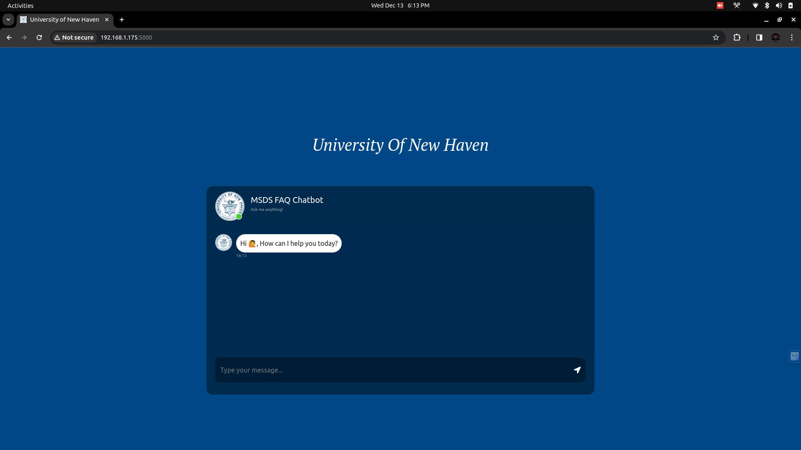
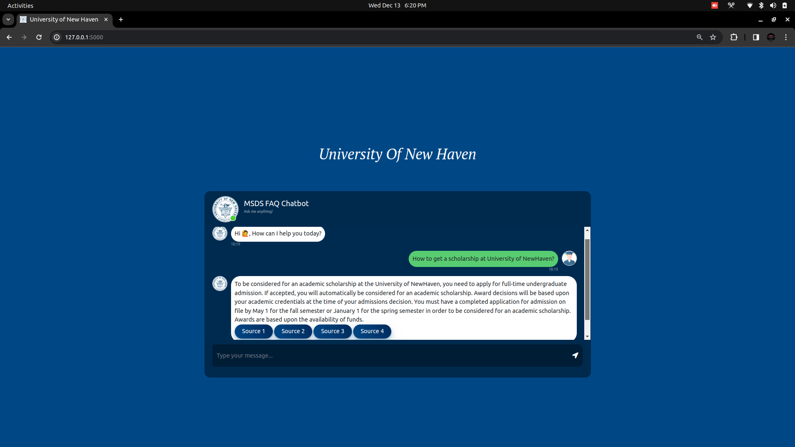

# University of New Haven AI FAQ Chatbot

## Overview
The University of New Haven FAQ Chatbot is a sophisticated tool designed to provide quick and accurate responses to student inquiries. Utilizing LangChain, a large language model, and Pinecone, a vector database, this chatbot stands out in its efficiency and reliability. Check out the project [here](https://github.com/VAMSINADH2000/AI-UNH-FAQ-BOT).

 




## App Architecture
The architecture of the application ensures seamless integration of various technologies for an optimal user experience.

## Project Structure
The project is organized into several key components:
- `main flask app.py`: The core Flask server and web application, managing user interactions and the chat interface.
- `loaddata.py`: Responsible for scraping, processing, and populating the Pinecone database with necessary data.
- UI Components: Includes static files and templates for the chatbot's user interface.

## Prerequisites
To get started, you'll need:
- Python 3.8 or higher
- Flask
- MongoDB account and cluster
- Pinecone account
- OpenAI API key
- A `.env` file with necessary environment variables

## Setup Instructions

### 1. Environment Variables
Set up your `.env` file with:
```
PINECONE_API_KEY=your_pinecone_api_key
PINECONE_ENVIRONMENT=your_pinecone_environment
PINECONE_INDEX=your_pinecone_index_name
```

### 2. MongoDB Configuration
- Create a MongoDB database and collection for storing conversations.
- Update the MongoDB URI in `main flask app.py`.

### 3. Pinecone Configuration
- Set up a Pinecone account and create an index.
- Update your `.env` file with Pinecone details.

### 4. Install Dependencies
Run `pip install –r requirements.txt` to install all necessary Python packages.

## Running the Application

### Data Loading
*Optional: The data may already be loaded.*
- Execute `loaddata.py` to scrape, process, and load FAQs into Pinecone.

### Starting the Flask App
- Run `python app.py` to start the Flask server.
- Alternatively, use Docker:
  - Build the image: `docker build -t unh-faq-bot .`
  - Run the container: `docker run -p 5000:5000 unh-faq-bot`

### Accessing the Web Interface
- Visit `http://localhost:5000/` in your browser to use the chatbot.

## Usage
- Users can ask questions via the chat interface.
- The bot provides answers with sources, when available.

## Managing Data
- Conversation data is stored in MongoDB.
- Utilize MongoDB's tools for data management and analysis.

## Troubleshooting
If issues occur, check:
- Environment variables in `.env`.
- MongoDB URI and database accessibility.
- Pinecone index configuration and permissions.
- Validity of Pinecone and OpenAI API keys.

## Conclusion
This  provides a detailed guide for setting up and running the University of New Haven FAQ Chatbot. For support or queries,  contact [Krishna Vamsi Nadh](https://www.linkedin.com/in/krishnavamsinadh/).

